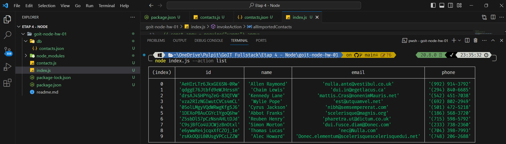
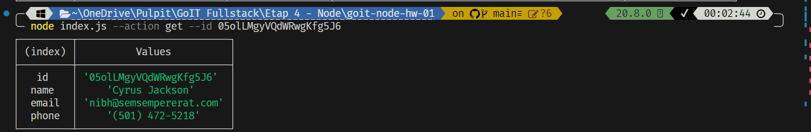
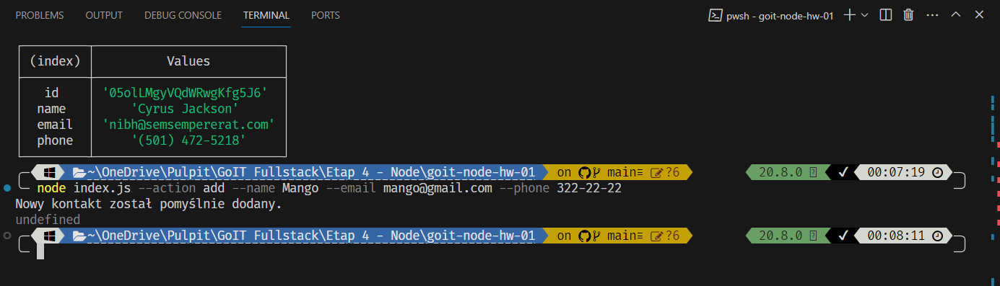
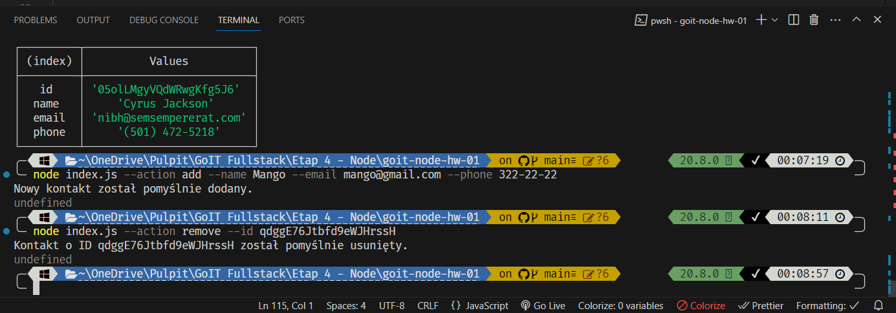

# Contact Management Application

A simple contact management application written in JavaScript using Node.js. It allows for adding, removing, listing, and searching contacts.

## Requirements

- Node.js (https://nodejs.org/)
- npm (Node.js package manager)

# Installation
## Clone repository:
```shell
git clone [repository-url]
```
## Change to the project directory:
```shell
cd [repository-name]

```
## Install and start:
```shell
npm install
```
# Features
## List Contacts:


## Find Contacts by Id:


## Add Contacts:


## Remove Contacts:


# Links to screenshots:
## https://ibb.co/JqRfQtT
## https://ibb.co/HG2h85n
## https://ibb.co/rxGCWB4
## https://ibb.co/0jDz881